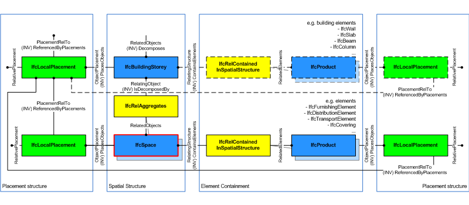
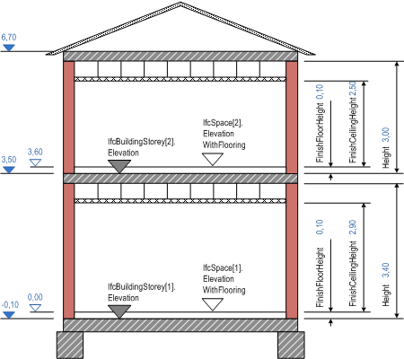
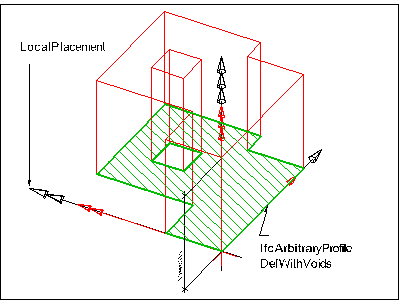
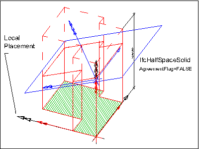

A space represents an area or volume bounded actually or theoretically. Spaces are areas or volumes that provide for certain functions within a building.

A space is associated to a building storey (or in case of exterior spaces to a site). A space may span over several connected spaces. Therefore a space group provides for a collection of spaces included in a storey. A space can also be decomposed in parts, where each part defines a partial space. This is defined by the _CompositionType_ attribute of the supertype _IfcSpatialStructureElement_ which is interpreted as follow:

* COMPLEX = space group
* ELEMENT = space
* PARTIAL = partial space

> NOTE&nbsp; View definitions and implementation agreements may restrict spaces with _CompositionType_=ELEMENT to be non-overlapping.

The _IfcSpace_ is used to build the spatial structure of a building (that serves as the primary project breakdown and is required to be hierarchical). The spatial structure elements are linked together by using the objectified relationship _IfcRelAggregates_.

Figure 1 shows the _IfcSpace_ as part of the spatial structure. It also serves as the spatial container for space related elements.

> NOTE&nbsp; Detailed requirements on mandatory element containment and placement structure relationships are given in view definitions and implementer agreements.

The following guidelines should apply for using the _Name_, _Description_, _LongName_ and _ObjectType_ attributes.

* _Name_ holds the unique name (or space number) from the plan.
* _Description_ holds any additional information field the user may have specified, there are no further recommendations.
* _LongName_ holds the full name of the space, it is often used in addition to the _Name_, if a number is assigned to the room, then the descriptive name is exchanged as _LongName_.
* _ObjectType_ holds the space type, i.e. usually the functional category of the space .

> NOTE&nbsp; In cases of inconsistency between the geometric representation of the _IfcSpace_ and the combined geometric representations of the surrounding _IfcRelSpaceBoundary_, the geometric representation of the space should take priority over the geometric representation of the surrounding space boundaries.

> HISTORY&nbsp; New entity in IFC1.0

{ .use-head}
Attribute Use Definition

Figure 2 describes the heights and elevations of the _IfcSpace_.

* elevation of the space (top of construction slab) equals elevation of storey: provided by _IfcBuildingStorey.Elevation_ relative to _IfcBuilding.ElevationOfRefHeight_
* elevation of the space flooring (top of flooring on top of slab): provided by _IfcSpace.ElevationWithFlooring_ relative to _IfcBuilding.ElevationOfRefHeight_
* height of space (top of slab below to bottom of slab above): provided by BaseQuantity with Name="Height"
* floor height of space (top of slab below to top of flooring): provided by BaseQuantity with Name="FinishFloorHeight"
* net height of space (top of flooring to bottom of suspended ceiling): provided by BaseQuantity with Name="FinishCeilingHeight"

___
## Common Use Definitions
The following concepts are inherited at supertypes:

* _IfcRoot_: [Identity](../../templates/identity.htm), [Revision Control](../../templates/revision-control.htm)

[&nbsp;Instance diagram](../../../annex/annex-d/common-use-definitions/ifcspace.htm)

{ .use-head}
Spatial Decomposition

The [Spatial Decomposition](../../templates/spatial-decomposition.htm) concept applies to this entity.

By using the inverse relationship _IfcSpace.Decomposes_ it references _IfcSite_ || _IfcBuildingStorey_ || _IfcSpace_ by _IfcRelAggregates.RelatingObject_. If it refers to another instance of _IfcSpace_, the referenced _IfcSpace_ needs to have a different and higher _CompositionType_, i.e. COMPLEX (if the other _IfcSpace_ has ELEMENT), or ELEMENT (if the other _IfcSpace_ has PARTIAL).

  
  
{ .use-head}
Spatial Composition

The [Spatial Composition](../../templates/spatial-composition.htm) concept applies to this entity.

By using the inverse relationship _IfcSpace.IsDecomposedBy_ it references _IfcSpace_ by _IfcRelAggregates.RelatedObjects_. If it refers to another instance of _IfcSpace_, the referenced _IfcSpace_ needs to have a different and lower _CompositionType_, i.e. ELEMENT (if the other _IfcSpace_ has COMPLEX), or PARTIAL (if the other _IfcSpace_ has ELEMENT).

  
  
{ .use-head}
Spatial Container

The [Spatial Container](../../templates/spatial-container.htm) concept applies to this entity.

If there are building elements and/or other elements directly related to the _IfcSpace_ (like most furniture and distribution elements), they are associated with the _IfcSpace_ by using the objectified relationship _IfcRelContainedInSpatialStructure_. The _IfcSpace_ references them by its inverse relationship:

* _IfcSpace.ContainsElements_ -- referencing any subtype of _IfcProduct_ (with the exception of other spatial structure element) by _IfcRelContainedInSpatialStructure.RelatedElements_.

  
  
{ .use-head}
Property Sets for Objects

The [Property Sets for Objects](../../templates/property-sets-for-objects.htm) concept applies to this entity as shown in Table 1.

<table>
<tr><td>
<table class="gridtable">
<tr><th><b>PredefinedType</b></th><th><b>Name</b></th></tr>
<tr><td>&nbsp;</td><td><a href="../../psd/ifcproductextension/Pset_SpaceCommon.xml">Pset_SpaceCommon</a></td></tr>
<tr><td>&nbsp;</td><td><a href="../../psd/ifcproductextension/Pset_SpaceParking.xml">Pset_SpaceParking</a></td></tr>
<tr><td>&nbsp;</td><td><a href="../../psd/ifcsharedbldgserviceelements/Pset_SpaceThermalDesign.xml">Pset_SpaceThermalDesign</a></td></tr>
<tr><td>&nbsp;</td><td><a href="../../psd/ifcsharedbldgserviceelements/Pset_SpaceThermalLoad.xml">Pset_SpaceThermalLoad</a></td></tr>
<tr><td>&nbsp;</td><td><a href="../../psd/ifcsharedbldgserviceelements/Pset_SpaceThermalLoadPHistory.xml">Pset_SpaceThermalLoadPHistory</a></td></tr>
<tr><td>&nbsp;</td><td><a href="../../psd/ifchvacdomain/Pset_SpaceThermalPHistory.xml">Pset_SpaceThermalPHistory</a></td></tr>
<tr><td>&nbsp;</td><td><a href="../../psd/ifcsharedfacilitieselements/Pset_PropertyAgreement.xml">Pset_PropertyAgreement</a></td></tr>
<tr><td>&nbsp;</td><td><a href="../../psd/ifcsharedbldgserviceelements/Pset_AirSideSystemInformation.xml">Pset_AirSideSystemInformation</a></td></tr>
<tr><td>&nbsp;</td><td><a href="../../psd/ifcproductextension/Pset_SpaceFireSafetyRequirements.xml">Pset_SpaceFireSafetyRequirements</a></td></tr>
<tr><td>&nbsp;</td><td><a href="../../psd/ifcproductextension/Pset_SpaceLightingRequirements.xml">Pset_SpaceLightingRequirements</a></td></tr>
<tr><td>&nbsp;</td><td><a href="../../psd/ifcproductextension/Pset_SpaceOccupancyRequirements.xml">Pset_SpaceOccupancyRequirements</a></td></tr>
<tr><td>&nbsp;</td><td><a href="../../psd/ifcproductextension/Pset_SpaceThermalRequirements.xml">Pset_SpaceThermalRequirements</a></td></tr>
<tr><td>&nbsp;</td><td><a href="../../psd/ifcsharedbldgserviceelements/Pset_ThermalLoadAggregate.xml">Pset_ThermalLoadAggregate</a></td></tr>
<tr><td>&nbsp;</td><td><a href="../../psd/ifcsharedbldgserviceelements/Pset_ThermalLoadDesignCriteria.xml">Pset_ThermalLoadDesignCriteria</a></td></tr>
</table>
</td></tr>
<tr><td>
Table 1 &mdash; IfcSpace Property Sets for Objects
</td></tr></table>

  
  
{ .use-head}
Quantity Sets

The [Quantity Sets](../../templates/quantity-sets.htm) concept applies to this entity as shown in Table 2.

<table>
<tr><td>
<table class="gridtable">
<tr><th><b>Name</b></th></tr>
<tr><td><a href="../../qto/ifcproductextension/Qto_SpaceBaseQuantities.xml">Qto_SpaceBaseQuantities</a></td></tr>
</table>
</td></tr>
<tr><td>
Table 2 &mdash; IfcSpace Quantity Sets
</td></tr></table>

  
  
{ .use-head}
Space Boundaries

The [Space Boundaries](../../templates/space-boundaries.htm) concept applies to this entity.

  
  
{ .use-head}
Product Placement

The [Product Placement](../../templates/product-placement.htm) concept applies to this entity.

The local placement for _IfcSpace_ is defined in its supertype _IfcProduct_. It is defined by the _IfcLocalPlacement_, which defines the local coordinate system that is referenced by all geometric representations.

* The _PlacementRelTo_ relationship of _IfcLocalPlacement_ shall point to the local placement of the _IfcSpatialStructureElement_ of type "IfcBuildingStorey", if relative placement is used, or of type "IfcSpace" (e.g. to position a space relative to a space group, or a partial space to a space).
* If the relative placement is not used, the absolute placement is defined within the world coordinate system.

  
  
{ .use-head}
FootPrint GeomSet Geometry

The [FootPrint GeomSet Geometry](../../templates/footprint-geomset-geometry.htm) concept applies to this entity as shown in Table 3.

<table>
<tr><td>
<table class="gridtable">
<tr><th><b>Identifier</b></th><th><b>Type</b></th><th><b>Items</b></th><th><b>Description</b></th></tr>
<tr><td>FootPrint</td><td>Curve2D</td><td><a href="../../ifcgeometryresource/lexical/ifcboundedcurve.htm">IfcBoundedCurve</a></td><td>A single curve defining the outer boundary</td></tr>
<tr><td>FootPrint</td><td>GeometricCurveSet</td><td><a href="../../ifcgeometricmodelresource/lexical/ifcgeometriccurveset.htm">IfcGeometricCurveSet</a></td><td>Set of curves (outer and inner) representing the floor projection,</td></tr>
</table>
</td></tr>
<tr><td>
Table 3 &mdash; IfcSpace FootPrint GeomSet Geometry
</td></tr></table>

The following constraints apply to the 2D representation:

* An _IfcBoundedCurve_ is required, using _IfcPolyline_ for faceted space contours or _IfcCompositeCurve_ for space contours with arc segments. For spaces with inner boundaries, a set of _IfcBoundedCurve_'s is used, that should be grouped into an _IfcGeometricCurveSet_.

&nbsp;

<table cellpadding="2" cellspacing="2">
 
<tr valign="top">
  <td align="left" valign="top"></td>
  <td><blockquote class="example">EXAMPLE&nbsp; Figure 3 shows a two-dimensional bounded curve representing the
foot print of <em>IfcSpace</em>.</blockquote></td>
 </tr>

 <tr>
  <td>
Figure 3 &mdash; Space footprint
</td>
  <td>&nbsp;</td>
 </tr>

</table>

  
  
{ .use-head}
Body SweptSolid Geometry

The [Body SweptSolid Geometry](../../templates/body-sweptsolid-geometry.htm) concept applies to this entity.

The following constraints apply to the standard representation:

* **Solid**: _IfcExtrudedAreaSolid_ is required,
* **Profile**: _IfcArbitraryClosedProfileDef_ is required, _IfcArbitraryProfileDefWithVoids_ shall be supported.
* **Extrusion**: The extrusion direction shall be vertically, i.e., along the positive Z Axis of the co-ordinate system of the containing spatial structure element.

Figure 4 shows an extrusion of an arbitrary profile definition with voids into the swept area solid of _IfcSpace_.

  
  
{ .use-head}
Body Clipping Geometry

The [Body Clipping Geometry](../../templates/body-clipping-geometry.htm) concept applies to this entity.

The following additional constraints apply to the advanced representation:

* **Solid**: see standard geometric representation,
* **Profile**: see standard geometric representation,
* **Extrusion**: see standard geometric representation,
* **Boolean result**: The difference operation with the second operand being of type _IfcHalfSpaceSolid_ (or one of its subtypes) shall be supported.

Figure 5 shows an extrusion of an arbitrary profile definition into the swept area solid. The solid and an half space solid are operands of the Boolean result of _IfcSpace_.

