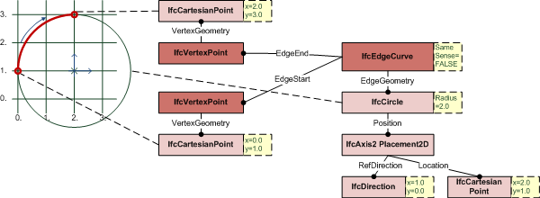

An _IfcEdgeCurve_ defines two vertices being connected topologically including the geometric representation of the connection.

&nbsp;

<table>
<tr><td> </td>
<td><blockquote class="example">EXAMPLE&nbsp; Figure 1 illustrates an example where the edge geometry is given by an unbounded curve, here <em>IfcCircle</em>. The bounds are provided by the <em>EdgeStart</em> and <em>EdgeEnd</em>, the topological direction of the <em>IfcEdgeCurve</em> opposes the direction of the <em>IfcCircle</em> by <em>SameSense</em> = FALSE.</blockquote></td>
</tr>
<tr><td>
Figure 1 &mdash; Edge curve
</td><td>&nbsp;</td><td>&nbsp;</td></tr>
</table>

&nbsp;

{ .extDef}
> NOTE&nbsp; Definition according to ISO/CD 10303-42:1992  
> An edge curve is a special subtype of edge which has its geometry fully defined. The geometry is defined by associating the edge with a curve which may be unbounded. As the topological and geometric directions may be opposed, an indicator (same sense) is used to identify whether the edge and curve directions agree or are opposed. The Boolean value indicates whether the curve direction agrees with (TRUE) or is in the opposite direction (FALSE) to the edge direction. Any geometry associated with the vertices of the edge shall be consistent with the edge geometry. Multiple edges can reference the same curve.

> NOTE&nbsp; Entity adapted from **edge_curve** defined in ISO 10303-42.

> HISTORY&nbsp; New entity in IFC2x.

{ .spec-head}
Informal Propositions:

1. The domain of the edge curve is formally defined to be the domain of its edge geometry as trimmed by the vertices. This domain does not include the vertices.
2. An edge curve has non-zero finite extent.
3. An edge curve is a manifold.
4. An edge curve is arcwise connected.
5. The edge start is not a part of the edge domain.
6. The edge end is not a part of the edge domain.
7. Vertex geometry shall be consistent with edge geometry.

___
Figure 2 illustrates edge curve usage.

