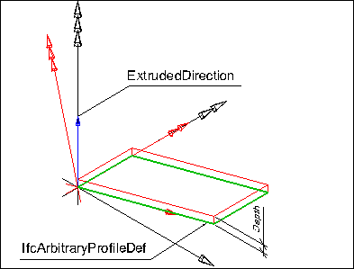

A ramp comprises a single inclined segment, or several inclined segments that are connected by a horizontal segment, refered to as a landing. A ramp flight is the single inclined segment and part of the ramp construction. In case of single flight ramps, the ramp flight and the ramp are identical.

> NOTE&nbsp; A single flight ramp is represented by an _IfcRamp_ instance without using aggregation and by utilizing the product shape representation directly at _IfcRamp_.

An _IfcRampFlight_ is an aggregated part of an _IfcRamp_ realized through the _IfcRelAggregates_ relationship, the ramp flight is therefore included in the set of _IfcRelAggregates.RelatedObjects_.

An _IfcRampFlight_ connects the floor slab of zero to two different storeys (or partial storeys or landings) within a building. The connection relationship between the _IfcRampFlight_ and the _IfcSlab_ is expressed using the _IfcRelConnectsElements_ relationship.

> HISTORY&nbsp; New entity in IFC2.0.

___
## Common Use Definitions
The following concepts are inherited at supertypes:

* _IfcRoot_: [Identity](../../templates/identity.htm), [Revision Control](../../templates/revision-control.htm)
* _IfcElement_: [Product Placement](../../templates/product-placement.htm), [Box Geometry](../../templates/box-geometry.htm), [Body SurfaceOrSolidModel Geometry](../../templates/body-surfaceorsolidmodel-geometry.htm), [Body SurfaceModel Geometry](../../templates/body-surfacemodel-geometry.htm), [Body Tessellation Geometry](../../templates/body-tessellation-geometry.htm), [Body Brep Geometry](../../templates/body-brep-geometry.htm), [Body AdvancedBrep Geometry](../../templates/body-advancedbrep-geometry.htm), [Body CSG Geometry](../../templates/body-csg-geometry.htm), [Mapped Geometry](../../templates/mapped-geometry.htm)
* _IfcBuildingElement_: [Product Assignment](../../templates/product-assignment.htm), [Surface 3D Geometry](../../templates/surface-3d-geometry.htm)

[&nbsp;Instance diagram](../../../annex/annex-d/common-use-definitions/ifcrampflight.htm)

{ .use-head}
Object Typing

The [Object Typing](../../templates/object-typing.htm) concept applies to this entity as shown in Table 1.

<table>
<tr><td>
<table class="gridtable">
<tr><th><b>Type</b></th></tr>
<tr><td><a href="../../ifcsharedbldgelements/lexical/ifcrampflighttype.htm">IfcRampFlightType</a></td></tr>
</table>
</td></tr>
<tr><td>
Table 1 &mdash; IfcRampFlight Object Typing
</td></tr></table>

  
  
{ .use-head}
Property Sets for Objects

The [Property Sets for Objects](../../templates/property-sets-for-objects.htm) concept applies to this entity as shown in Table 2.

<table>
<tr><td>
<table class="gridtable">
<tr><th><b>PredefinedType</b></th><th><b>Name</b></th></tr>
<tr><td>&nbsp;</td><td><a href="../../psd/ifcsharedbldgelements/Pset_RampFlightCommon.xml">Pset_RampFlightCommon</a></td></tr>
<tr><td>&nbsp;</td><td><a href="../../psd/ifcstructuralelementsdomain/Pset_ConcreteElementGeneral.xml">Pset_ConcreteElementGeneral</a></td></tr>
<tr><td>&nbsp;</td><td><a href="../../psd/ifcstructuralelementsdomain/Pset_PrecastConcreteElementFabrication.xml">Pset_PrecastConcreteElementFabrication</a></td></tr>
<tr><td>&nbsp;</td><td><a href="../../psd/ifcstructuralelementsdomain/Pset_PrecastConcreteElementGeneral.xml">Pset_PrecastConcreteElementGeneral</a></td></tr>
<tr><td>&nbsp;</td><td><a href="../../psd/ifcsharedfacilitieselements/Pset_Condition.xml">Pset_Condition</a></td></tr>
<tr><td>&nbsp;</td><td><a href="../../psd/ifcproductextension/Pset_EnvironmentalImpactIndicators.xml">Pset_EnvironmentalImpactIndicators</a></td></tr>
<tr><td>&nbsp;</td><td><a href="../../psd/ifcproductextension/Pset_EnvironmentalImpactValues.xml">Pset_EnvironmentalImpactValues</a></td></tr>
<tr><td>&nbsp;</td><td><a href="../../psd/ifcsharedfacilitieselements/Pset_ManufacturerOccurrence.xml">Pset_ManufacturerOccurrence</a></td></tr>
<tr><td>&nbsp;</td><td><a href="../../psd/ifcsharedfacilitieselements/Pset_ManufacturerTypeInformation.xml">Pset_ManufacturerTypeInformation</a></td></tr>
<tr><td>&nbsp;</td><td><a href="../../psd/ifcsharedmgmtelements/Pset_PackingInstructions.xml">Pset_PackingInstructions</a></td></tr>
<tr><td>&nbsp;</td><td><a href="../../psd/ifcsharedfacilitieselements/Pset_ServiceLife.xml">Pset_ServiceLife</a></td></tr>
<tr><td>&nbsp;</td><td><a href="../../psd/ifcsharedfacilitieselements/Pset_Warranty.xml">Pset_Warranty</a></td></tr>
</table>
</td></tr>
<tr><td>
Table 2 &mdash; IfcRampFlight Property Sets for Objects
</td></tr></table>

  
  
{ .use-head}
Quantity Sets

The [Quantity Sets](../../templates/quantity-sets.htm) concept applies to this entity as shown in Table 3.

<table>
<tr><td>
<table class="gridtable">
<tr><th><b>Name</b></th></tr>
<tr><td><a href="../../qto/ifcsharedbldgelements/Qto_RampFlightBaseQuantities.xml">Qto_RampFlightBaseQuantities</a></td></tr>
</table>
</td></tr>
<tr><td>
Table 3 &mdash; IfcRampFlight Quantity Sets
</td></tr></table>

  
  
{ .use-head}
Material Single

The [Material Single](../../templates/material-single.htm) concept applies to this entity.

The material of the _IfcRampFlight_ is defined by the _IfcMaterial_ and attached by the _IfcRelAssociatesMaterial_._RelatingMaterial_. It is accessible by the inverse _HasAssociations_ relationship.

  
  
{ .use-head}
Spatial Containment

The [Spatial Containment](../../templates/spatial-containment.htm) concept applies to this entity as shown in Table 4.

<table>
<tr><td>
<table class="gridtable">
<tr><th><b>Structure</b></th><th><b>Description</b></th></tr>
<tr><td><a href="../../ifcproductextension/lexical/ifcbuildingstorey.htm">IfcBuildingStorey</a></td><td>Default spatial container, if the ramp flight is not used (by default) as a part within a ramp container.</td></tr>
<tr><td><a href="../../ifcproductextension/lexical/ifcbuilding.htm">IfcBuilding</a></td><td>Spatial container for the element if it cannot be assigned to a building storey</td></tr>
<tr><td><a href="../../ifcproductextension/lexical/ifcsite.htm">IfcSite</a></td><td>Spatial container for the element in case that it is placed on site (outside of building)</td></tr>
</table>
</td></tr>
<tr><td>
Table 4 &mdash; IfcRampFlight Spatial Containment
</td></tr></table>

The _IfcRampFlight_, as any subtype of _IfcBuildingElement_, may participate alternatively in one of the two different containment relationships:

* the _Spatial Containment_ (defined here), or
* the _Element Composition_.

> NOTE&nbsp; Model view definitions or implementer agreements may force an _IfcRampFlight_ to be solely used as a part within an _IfcRamp_ container. In this case, no _Spatial containment_ shall be used.

  
  
{ .use-head}
Axis 2D Geometry

The [Axis 2D Geometry](../../templates/axis-2d-geometry.htm) concept applies to this entity.

The walking line is represented by a two-dimensional open curve as the axis. The curve is directed into the upward direction (direction has to be interpreted as specified at the subtypes of _IfcCurve_).

Figure 1 illustrates the axis representation which has the following constraints:

* In case of straight flights the curve shall be a single item of type _IfcPolyline_.
* In case of winding flights the curve shall be a single item of type _IfcCompositeCurve_.
* In case of a curved flight or a spiral flight the curve shall be a single item of type _IfcTrimmedCurve_.

  
  
{ .use-head}
FootPrint Geometry

The [FootPrint Geometry](../../templates/footprint-geometry.htm) concept applies to this entity as shown in Table 5.

<table>
<tr><td>
<table class="gridtable">
<tr><th><b>Identifier</b></th><th><b>Type</b></th><th><b>Items</b></th><th><b>Description</b></th></tr>
<tr><td>FootPrint</td><td>GeometricCurveSet</td><td>&nbsp;</td><td>Any collection of points and curves representing the floor plan projection.</td></tr>
<tr><td>FootPrint</td><td>Annotation2D</td><td>&nbsp;</td><td>Any collection of points and curves, and additional hatching and text representing the floor plan projection.</td></tr>
</table>
</td></tr>
<tr><td>
Table 5 &mdash; IfcRampFlight FootPrint Geometry
</td></tr></table>

The flight foot print, including the flight boundary is represented by a two-dimensional geometric curve set.

Figure 2 illustrates the footprint representation which has the following constraints:

* In case of straight flights the curve set shall consist of a single item of type _IfcPolyline_.
* In case of winding flights or curved flights the curve set shall consists of a single item of type _IfcCompositeCurve_.
* In case of a spiral flight the curve set shall consists of a single item of type _IfcConic_ or _IfcPolyline_.

  
  
{ .use-head}
Body SweptSolid Geometry

The [Body SweptSolid Geometry](../../templates/body-sweptsolid-geometry.htm) concept applies to this entity.

The following additional constraints apply to the 'SweptSolid' representation type:

* **Solid**: _IfcExtrudedAreaSolid_ is required,
* **Profile**: _IfcRectangleProfileDef_ and _IfcArbitraryClosedProfileDef_ shall be supported.
* **Extrusion**: The profile shall be extruded in any direction relative to the XY plane of the position coordinate system of the _IfcExtrudedAreaSolid_. Therefore non-perpendicular sweep operation has to be supported. It might be further constrained to be in the direction of the global z-axis in implementers agreements.

Figure 3 illustrates the body representation.

  
  
{ .use-head}
Body Clipping Geometry

The [Body Clipping Geometry](../../templates/body-clipping-geometry.htm) concept applies to this entity.
