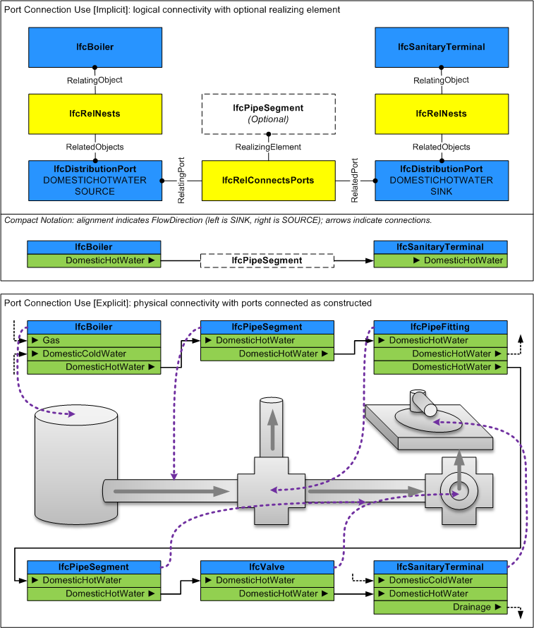

A distribution port is an inlet or outlet of a product through which a particular substance may flow.

Distribution ports are used for passage of solid, liquid, or gas substances, as well as electricity for power or communications. Flow segments (pipes, ducts, cables) may be used to connect ports across products. Distribution ports are defined by system type and flow direction such that for two ports to be connected, they must share the same system type and have opposite flow directions (one side being a _SOURCE_ and the other being a _SINK_). Ports are similar to openings in that they do not have any visible geometry; such geometry is captured at the shape representation of the enclosing element or element type. Ports may have placement that indicates the position and orientation of the connection.

> HISTORY&nbsp; New entity in IFC2x2

{ .change-ifc2x4}
> IFC4 CHANGE&nbsp; Ports are now related to products and product types using the _IfcRelNests_ relationship; use of _IfcRelConnectsPortToElement_ is now reserved for dynamically attached ports (such as drilling a hole in a tank).

___
## Common Use Definitions
The following concepts are inherited at supertypes:

* _IfcRoot_: [Identity](../../templates/identity.htm), [Revision Control](../../templates/revision-control.htm)

[&nbsp;Instance diagram](../../../annex/annex-d/common-use-definitions/ifcdistributionport.htm)

{ .use-head}
Property Sets for Objects

The [Property Sets for Objects](../../templates/property-sets-for-objects.htm) concept applies to this entity as shown in Table 1.

<table>
<tr><td>
<table class="gridtable">
<tr><th><b>PredefinedType</b></th><th><b>Name</b></th></tr>
<tr><td><a href="../../ifcsharedbldgserviceelements/lexical/ifcdistributionporttypeenum.htm">NOTDEFINED</a></td><td><a href="../../psd/ifcsharedbldgserviceelements/Pset_DistributionPortCommon.xml">Pset_DistributionPortCommon</a></td></tr>
<tr><td><a href="../../ifcsharedbldgserviceelements/lexical/ifcdistributionporttypeenum.htm">CABLE</a></td><td><a href="../../psd/ifcsharedbldgserviceelements/Pset_DistributionPortPHistoryCable.xml">Pset_DistributionPortPHistoryCable</a></td></tr>
<tr><td><a href="../../ifcsharedbldgserviceelements/lexical/ifcdistributionporttypeenum.htm">DUCT</a></td><td><a href="../../psd/ifcsharedbldgserviceelements/Pset_DistributionPortPHistoryDuct.xml">Pset_DistributionPortPHistoryDuct</a></td></tr>
<tr><td><a href="../../ifcsharedbldgserviceelements/lexical/ifcdistributionporttypeenum.htm">PIPE</a></td><td><a href="../../psd/ifcsharedbldgserviceelements/Pset_DistributionPortPHistoryPipe.xml">Pset_DistributionPortPHistoryPipe</a></td></tr>
<tr><td><a href="../../ifcsharedbldgserviceelements/lexical/ifcdistributionporttypeenum.htm">CABLE</a></td><td><a href="../../psd/ifcsharedbldgserviceelements/Pset_DistributionPortTypeCable.xml">Pset_DistributionPortTypeCable</a></td></tr>
<tr><td><a href="../../ifcsharedbldgserviceelements/lexical/ifcdistributionporttypeenum.htm">DUCT</a></td><td><a href="../../psd/ifcsharedbldgserviceelements/Pset_DistributionPortTypeDuct.xml">Pset_DistributionPortTypeDuct</a></td></tr>
<tr><td><a href="../../ifcsharedbldgserviceelements/lexical/ifcdistributionporttypeenum.htm">PIPE</a></td><td><a href="../../psd/ifcsharedbldgserviceelements/Pset_DistributionPortTypePipe.xml">Pset_DistributionPortTypePipe</a></td></tr>
</table>
</td></tr>
<tr><td>
Table 1 &mdash; IfcDistributionPort Property Sets for Objects
</td></tr></table>

  
  
{ .use-head}
Port Nesting

The [Port Nesting](../../templates/port-nesting.htm) concept applies to this entity.

Distribution ports are indicated on products and product types using the _IfcRelNests_ relationship where _RelatingObject_ refers to the enclosing _IfcDistributionElement_ or _IfcDistributionElementType_ respectively. The order of ports indicates logical ordering such within outlets, junction boxes, or communications equipment.

Ports may be further nested into sub-ports, for indicating specific connections on components or pins.

  
  
{ .use-head}
Product Assignment

The [Product Assignment](../../templates/product-assignment.htm) concept applies to this entity as shown in Table 2.

<table>
<tr><td>
<table class="gridtable">
<tr><th><b>Type</b></th><th><b>Description</b></th></tr>
<tr><td><a href="../../ifcsharedbldgserviceelements/lexical/ifcdistributionsystem.htm">IfcDistributionSystem</a></td><td>Indicates a system that is hosted by the port, as the origination.</td></tr>
<tr><td><a href="../../ifcsharedbldgserviceelements/lexical/ifcdistributioncircuit.htm">IfcDistributionCircuit</a></td><td>Indicates a circuit that is switched by the port, as the origination.</td></tr>
</table>
</td></tr>
<tr><td>
Table 2 &mdash; IfcDistributionPort Product Assignment
</td></tr></table>

The **IfcDistributionPort** may be assigned to the following entities using relationships as indicated:

* [IfcDistributionSystem](../../ifcsharedbldgserviceelements/lexical/ifcdistributionsystem.htm) ([IfcRelAssignsToGroup](../../ifckernel/lexical/ifcrelassignstogroup.htm)): Indicates a system containing interconnected devices.
* [IfcPerformanceHistory](../../ifccontrolextension/lexical/ifcperformancehistory.htm) ([IfcRelAssignsToControl](../../ifckernel/lexical/ifcrelassignstocontrol.htm)): Indicates realtime or historical infomation captured for the device.

  
  
{ .use-head}
Port Connectivity

The [Port Connectivity](../../templates/port-connectivity.htm) concept applies to this entity.

**IfcDistributionPort** may be connected to other objects as follows using the indicated relationship:

* **IfcDistributionPort** (_IfcRelConnectsPorts_) : Indicates a connection to another port having the same type and opposite flow direction. For port connections between elements, the _RelatingPort_ is set to a port having _FlowDirection=SOURCE_ and the _RelatedPort_ is set to a port having _FlowDirection=SINK_. For aggregation scenarios, ports on a device may be mapped to aggregated devices within, in which case ports on the outer device indicate a single _FlowDirection_ but have an additional connection internally to a port on an aggregated inner device. Refer to [IfcUnitaryEquipment](../../ifchvacdomain/lexical/ifcunitaryequipment.htm) for an example.
* _IfcDistributionElement_ (_IfcRelConnectsPortToElement_): For dynamic ports, indicates the containing element. 

Figure 1 illustrates distribution port connectivity.

  
  
{ .use-head}
Product Placement

The [Product Placement](../../templates/product-placement.htm) concept applies to this entity.

The placement of a port indicates the position and orientation of how it may connect to a compatible port on another product. The placement shall be relative to the nesting _IfcDistributionElement_, _IfcDistributionElementType_, or enclosing _IfcDistributionPort_.

The _Location_ is the midpoint of the physical connection, unless otherwise indicated by cardinal point on a material profile.

The _Axis_ points in the direction of the physical connection away from the product if _FlowDirection_ equals _SOURCE_ (or _SOURCEANDSINK_ or _NOTDEFINED_), or points opposite direction (to the product) if the _FlowDirection_ equals _SINK_.

> NOTE&nbsp; The rationale for positioning the _Axis_ in the direction of flow is to allow for the same geometry to be used, such as for connectors with polarized cross-section.

The _RefDirection_ points in the direction of the local X axis of the material profile, where the local Y axis points up if looking towards the _Axis_ where the local X axis points right.

Upon connecting elements through ports with rigid connections, each object shall be aligned such that the effective _Location_, _Axis_, and _RefDirection_ of each port is aligned to be equal (with exception for circular profiles where the _RefDirection_ need not be equal).
